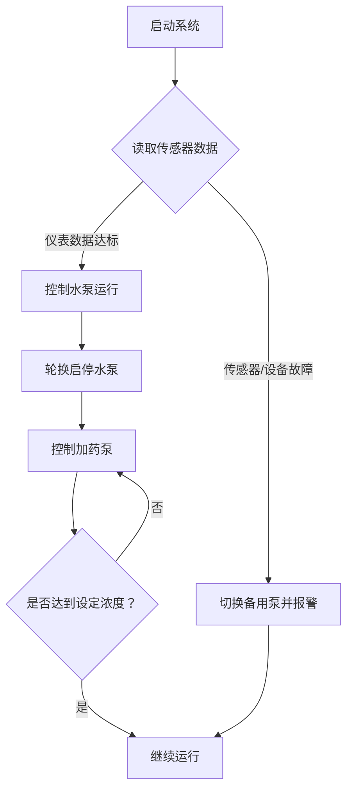
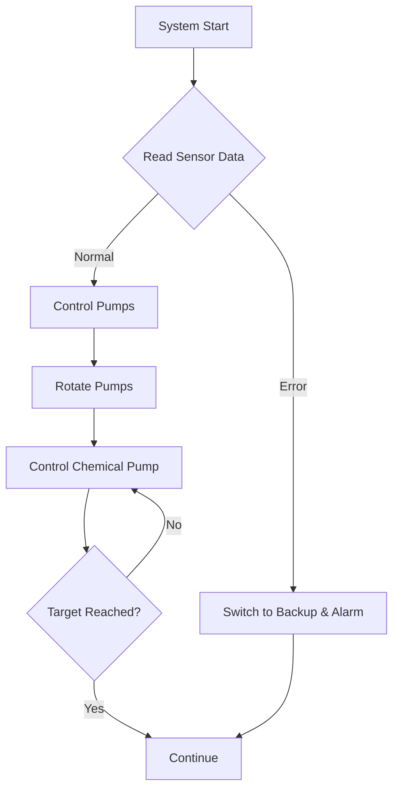

# PLC Program: Four-Pump Filtration and Chemical Dosing Control  
水厂过滤水加药控制程序

  
  

---

## English Version

##  **Overview**  
This PLC program is designed for use in water treatment engineering, which automatically controls water filtration and dosing by regulating the operation and quantity of water pumps, achieving automated water purification and unmanned functions.

###  Features
- **Pump Control**: Automatically control the start and stop of the water pump based on real-time water flow rate, pressure, and indirect parameters (such as pH value, concentration of reaction by-products, etc.) to achieve rotation of multiple pumps and one backup pump, extending the service life of the equipment. 
- **Chemical Dosing**: Accurately control the dosage of the dosing pump, so that the concentration of the chemicals changes with the water level, achieving the theoretical chemical reaction peak and optimizing the water treatment effect.
- **Fault Handling**: Equipped with fault detection and alarm functions, when there is an abnormality in the water pump or sensor, the system automatically switches to the backup pump and issues an alarm, ensuring the stability of the pharmaceutical factory's production output and the safety of the workshop.

###  Applications
Drinking water purification projects, stable equipment operation.

## 🌍 Environment Requirements

- **Operating System**: Windows 7 or higher (Windows 10 recommended)
- **Disk Space**: At least 2.1 GB of free storage
- **PLC Platform**: Siemens S7-300 series using Step 7 programming language
- **SCADA Software**: KingView 7.5 SP2
- **Simulation Support**: Can be integrated with factory simulation software (optional)

  

---

## 中文版本

## 概述
本PLC程序设计用于水处理工程中，通过调控水泵运行情况和数量进行滤水和加药的自动化控制，实现自动化净水和无人值守功能。

## 功能描述
- **水泵控制**  
  根据实时水流量、压力及间接参数（如pH值、反应副产物浓度等），自动控制水泵的启停，实现多泵及一个备用泵轮换运行，延长设备使用寿命。

- **加药调节**  
  精确控制加药泵的投加量，使药剂浓度随水位变化而变化，达到理论化学反应峰值优化水处理效果。

- **故障处理**  
  附有故障检测与报警功能，当水泵或传感器发生异常时，系统自动切换至备用泵并发出警报，确保药厂生产产出稳定性和车间的安全性。

## 应用场景
适用于饮用水净化工程，保障水质达标及设备运行稳定。

## 🌍 环境要求

- ✅ **操作系统 / OS**：Windows 7 或更高版本（Windows 10 推荐）
- ✅ **PLC 编程平台**：西门子 S7-300 系列（Step 7）
- ✅ **组态软件**：组态王 KingView 7.5 SP2
- ✅ **硬盘空间**：最少 2.1 GB 可用空间
- ✅ **可选支持**：支持接入厂房模拟软件进行联动仿真

  

## 🧩 流程图

## 🧩 Flowchart

